# Windows Server 2022 Enterprise Lab

## Phase 1 – Active Directory Foundation Deployment

----------

# 1. Project Overview

This project documents the deployment of a foundational Active Directory infrastructure using Windows Server 2022 Datacenter within a Hyper-V virtualized environment.

The objective of this phase was to design, implement, and validate a secure enterprise identity infrastructure including:

-   Active Directory Domain Services (AD DS)
    
-   Integrated DNS
    
-   Organizational Unit (OU) design
    
-   Security group structure
    
-   Client domain integration
    
-   Health validation and infrastructure verification
    

This lab simulates a small enterprise corporate environment operating within a controlled internal network.

----------

# 2. Lab Architecture

## 2.1 Virtualization Platform

-   Hyper-V (Windows 10 Host)
    
-   Generation 2 Virtual Machines
    
-   Dynamic Memory Enabled
    

## 2.2 Virtual Machines

|VM Name  |Role  |RAM  |IP Address  |
|--|--|--|--|
|DC01  |Domain Controller + DNS  |2 GB  |192.168.10.10  |
|CL01  |Windows 10 Client  |4 GB  |192.168.10.20


## 2.3 Network Design

-   Virtual Switch Type: Private Switch 
    
-   Switch Name: Corp-Internal
    
-   Subnet: 192.168.10.0/24
    
-   Default Gateway: 192.168.10.1 (simulated)
    
-   DNS Server: 192.168.10.10 (DC01)
**Screenshot – Network Design**  
    
This environment simulates an isolated corporate LAN infrastructure.

----------

# 3. Hyper-V Configuration

The Domain Controller was configured with:

-   Generation 1 VM
    
-   Secure Boot Disabled
    
-   2 GB Startup RAM
    
-   Dynamic Memory Disabled
    
-   2 vCPUs
    
-   32 GB Fixed VHDX Disk
    

Dynamic memory was configured to optimize host resource utilization while maintaining DC stability.

**Screenshot – Hyper-V Configuration**  
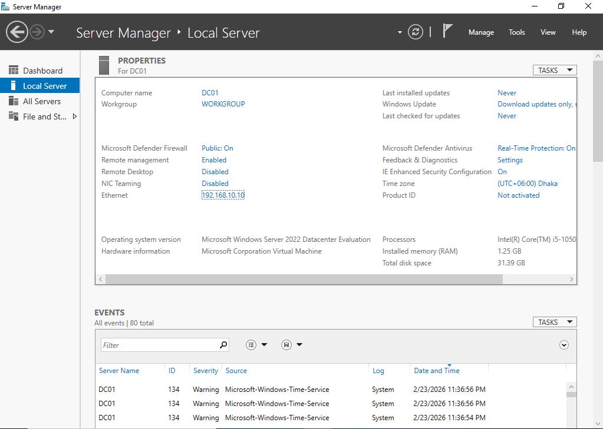

----------

# 4. Network Configuration (DC01)

The Domain Controller was configured with a static IPv4 address:

IP Address: 192.168.10.10  
Subnet Mask: 255.255.255.0  
Preferred DNS Server: 192.168.10.10

Static addressing ensures consistent identity and DNS resolution within an AD environment.

**Screenshot – DC IP Configuration**  
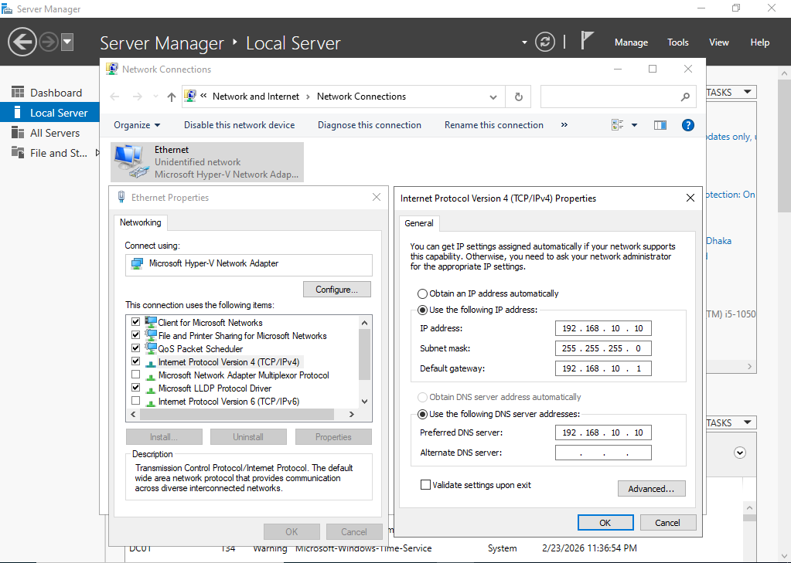

----------

# 5. Active Directory Domain Services Deployment

## 5.1 Role Installation

The Active Directory Domain Services role was installed using Server Manager.

Following installation, the server was promoted to a Domain Controller.

**Screenshot – DC Role Installation**  
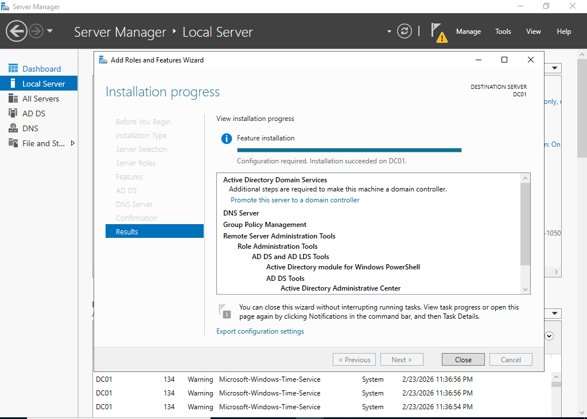

----------

## 5.2 Forest Creation

A new forest was created with the following configuration:

-   Root Domain Name: corp.local
    
-   Forest Functional Level: Windows Server 2019 
    
-   Domain Functional Level: Windows Server 2019 
    
-   DNS Server: Installed Automatically
    
-   DSRM Password: Configured Securely
    

The server was successfully promoted to Domain Controller and rebooted.

**Screenshot – Promoting to Domain Controller**  
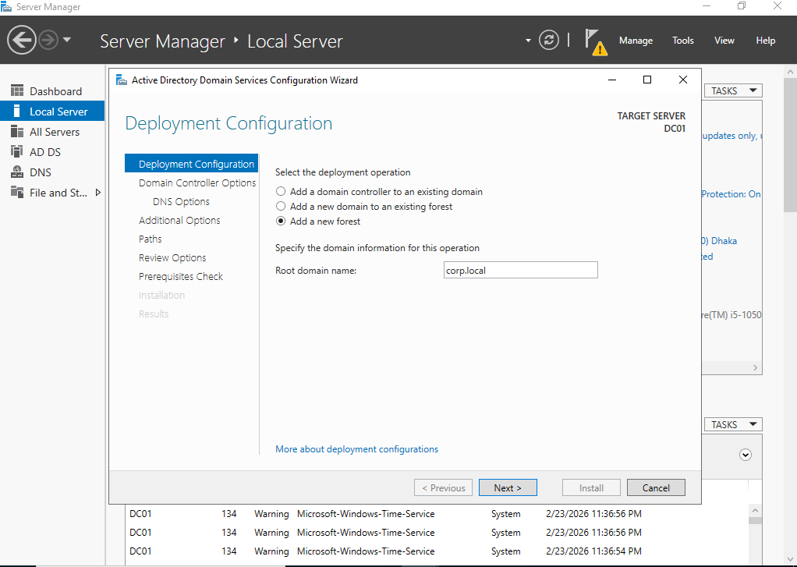

----------

# 6. DNS Configuration and Validation

Upon AD installation, the following zones were automatically created:

-   corp.local (Forward Lookup Zone)
    
-   _msdcs.corp.local
    
-   Reverse Lookup Zone: 10.168.192.in-addr.arpa
    

## 6.1 Validation Performed

-   Confirmed presence of SRV records
    
-   Verified Name Server (NS) entries
    
-   Verified PTR record resolution
    

Reverse lookup validation:

```
nslookup 192.168.10.10

```

Successfully resolved to:  
DC01.corp.local

**Screenshot – Forward Look Up Zone**  
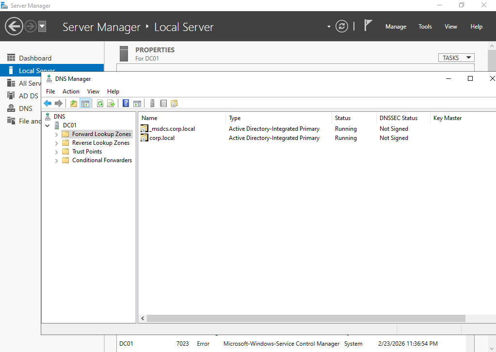
**Screenshot – Reverse Look Up Zone**  
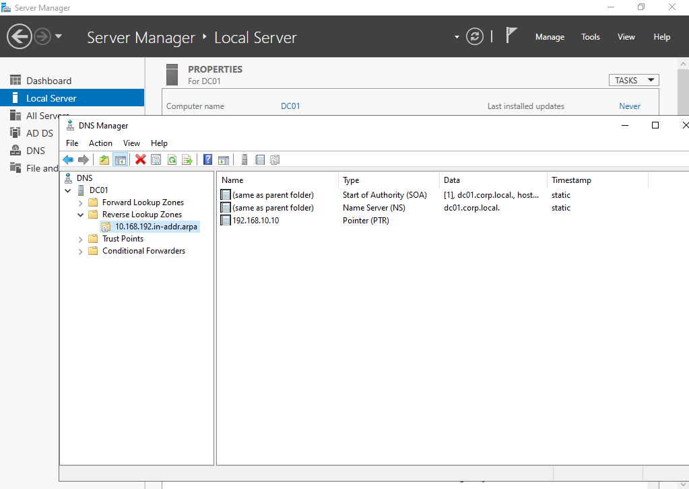
Proper DNS configuration is critical for AD authentication and service location.

----------

# 7. Organizational Unit (OU) and Security Design

A structured OU hierarchy was created to simulate enterprise separation of roles:

```
corp.local
│
├── Servers
├── Workstations
├── Users
│   ├── IT
│   ├── HR
│   └── Sales
├── Groups
└── Service Accounts

```

## 7.1 Security Groups Created

-   IT_Admin (Global Security Group)
    
-   Domain Support (optional if created)
    

IT users were added to appropriate security groups to simulate role-based access control.

**Screenshot – Organizational Structure**  
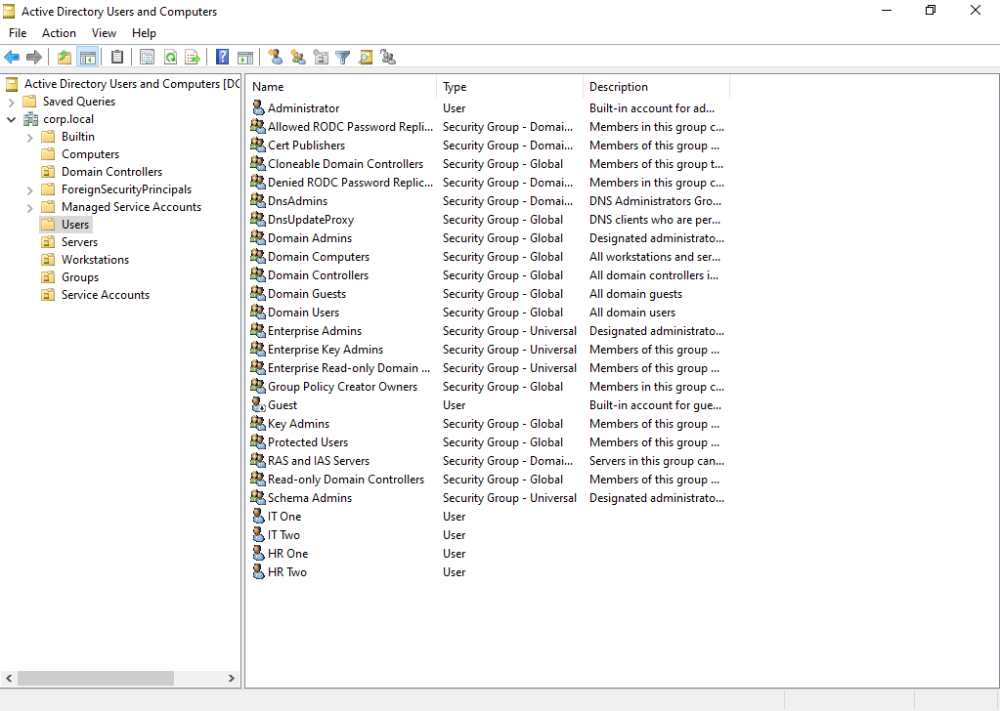
**Screenshot – Group Membership**  
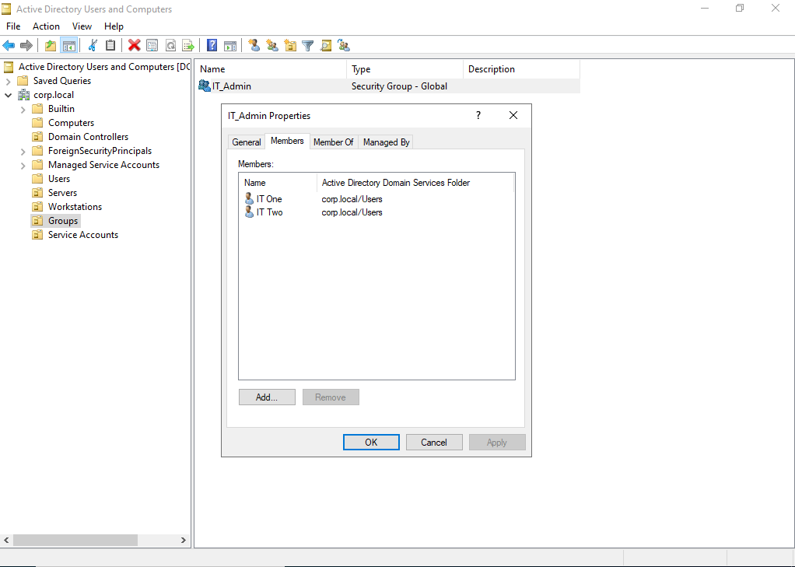
This design supports scalability and policy targeting.

----------

# 8. Client Domain Integration

The Windows 11 client (CL01) was configured to use DC01 as DNS server.

The client was successfully joined to the domain:

corp.local

Authentication test:

```
whoami

```

Returned:  
corp\itone
**Screenshot – CL01 System Properties**  

**Screenshot – whoami Output**  
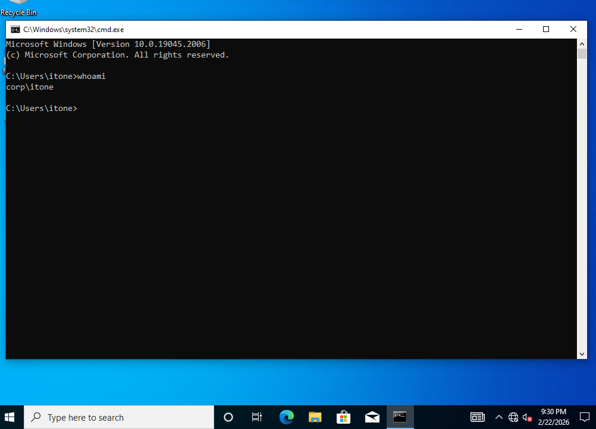

----------

# 9. Infrastructure Health Validation

Multiple validation commands were executed to verify domain integrity.

## 9.1 FSMO Role Verification

```
netdom query fsmo

```

All FSMO roles confirmed on DC01.

**Screenshot – FSMO Output**  
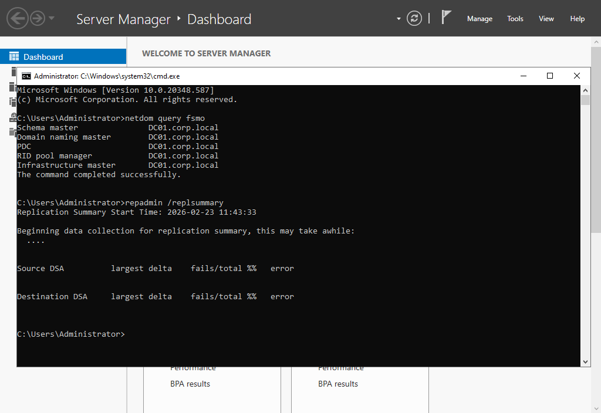

----------

## 9.2 Domain Controller Diagnostic

```
dcdiag /v

```

All major tests passed including:

-   LocatorCheck
    
-   Advertising
    
-   Intersite
    
-   Connectivity
    

**Screenshot – dcdiag Summary**  
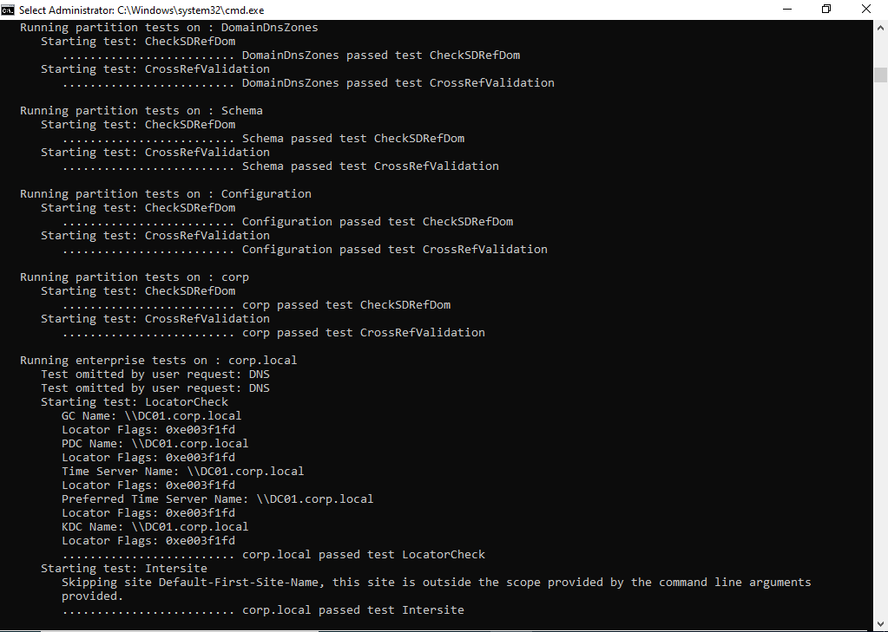

----------

## 9.3 Replication Check

```
repadmin /replsummary

```

No replication errors detected.

**Screenshot – repadmin Output**  


----------

## 9.4 Group Policy Validation (Client Side)

```
gpresult /r

```

Confirmed successful application of Default Domain Policy.

----------

# 10. Lessons Learned

-   DNS is foundational to Active Directory functionality.
    
-   Reverse lookup zones improve name resolution reliability.
    
-   Proper OU design enhances scalability and GPO targeting.
    
-   FSMO awareness is critical in single-DC environments.
    
-   Infrastructure validation tools (dcdiag, repadmin, netdom) are essential for production readiness.
    
-   Dynamic memory must be configured carefully for Domain Controllers in lab environments.
    

----------

# 11. Conclusion

This phase successfully established a functional and validated Windows Server 2022 Active Directory infrastructure.

The environment is now ready for:

-   Additional Domain Controller deployment
    
-   DHCP implementation
    
-   GPO security hardening
    
-   FSMO role transfer simulation
    
-   Disaster recovery testing
    

This concludes Phase 1 – Enterprise Identity Foundation.
