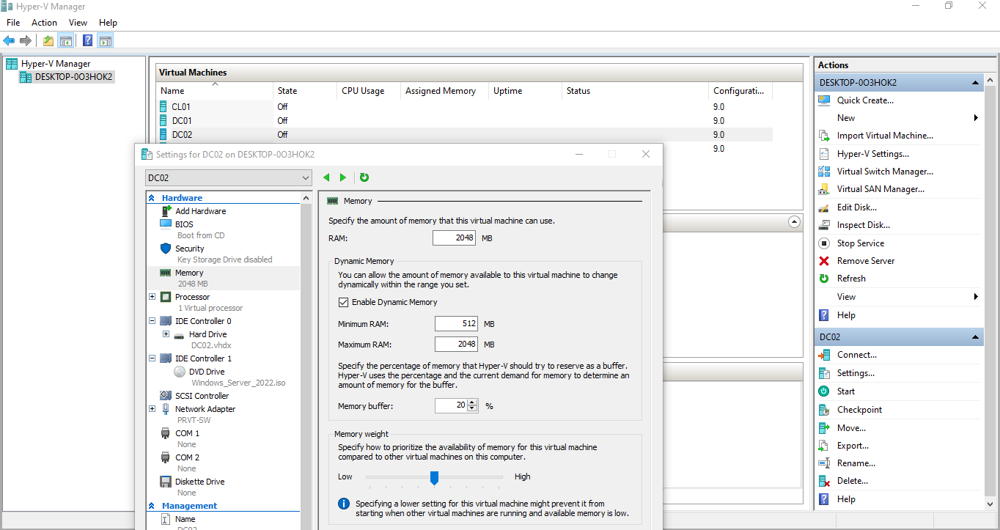
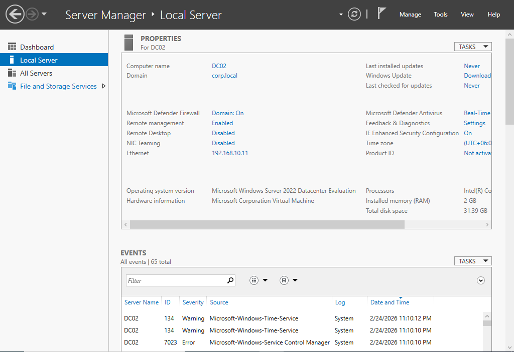
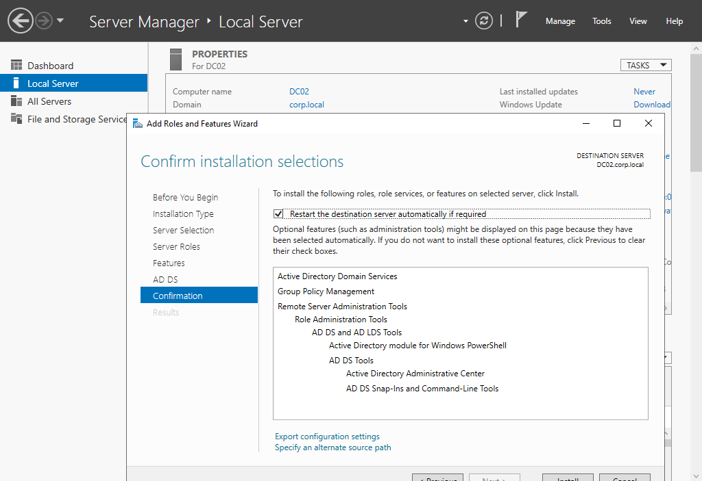
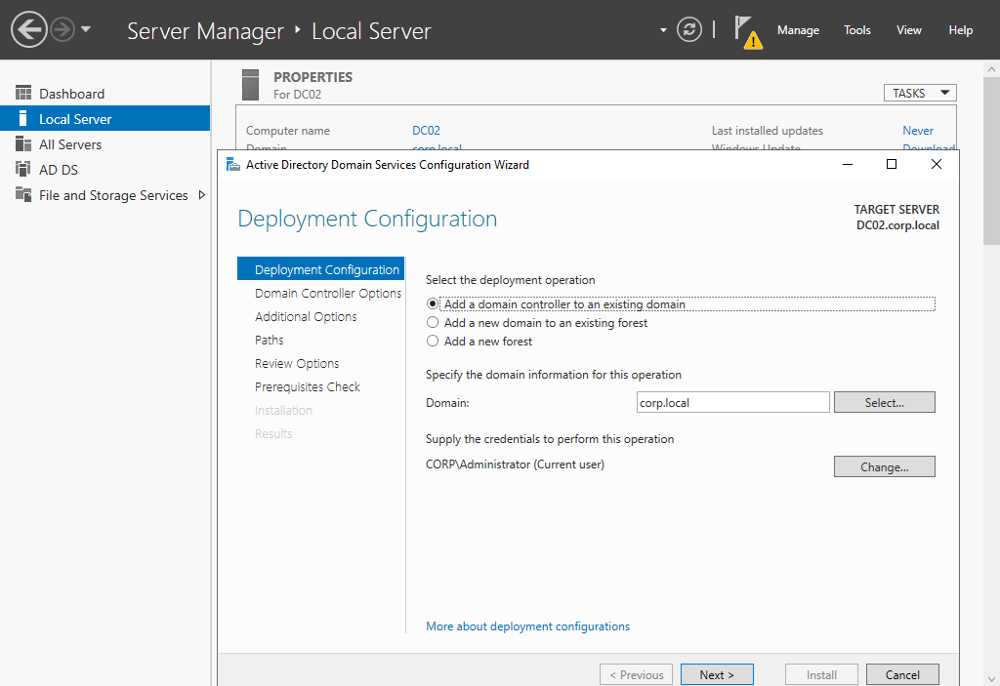
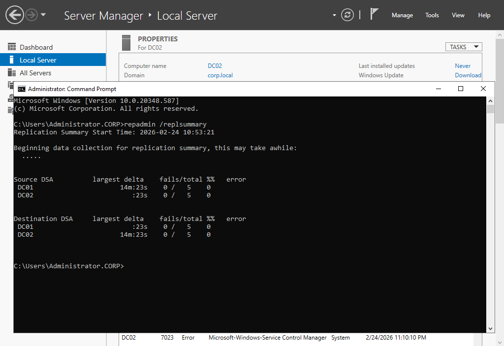
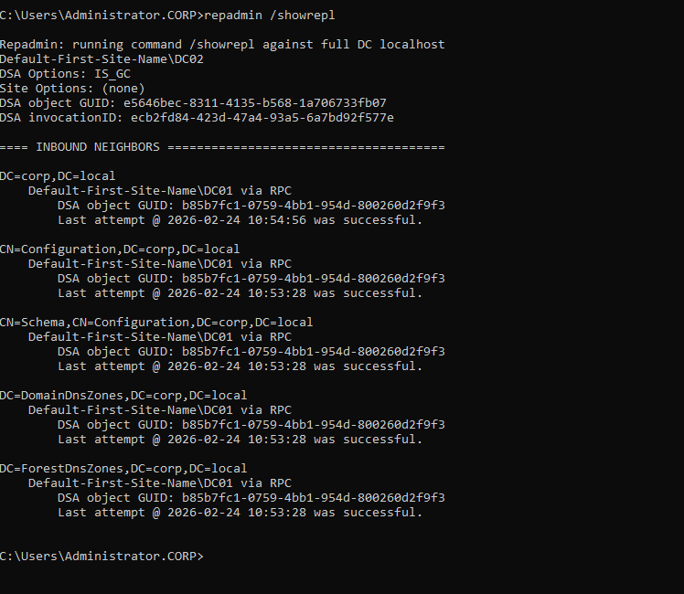
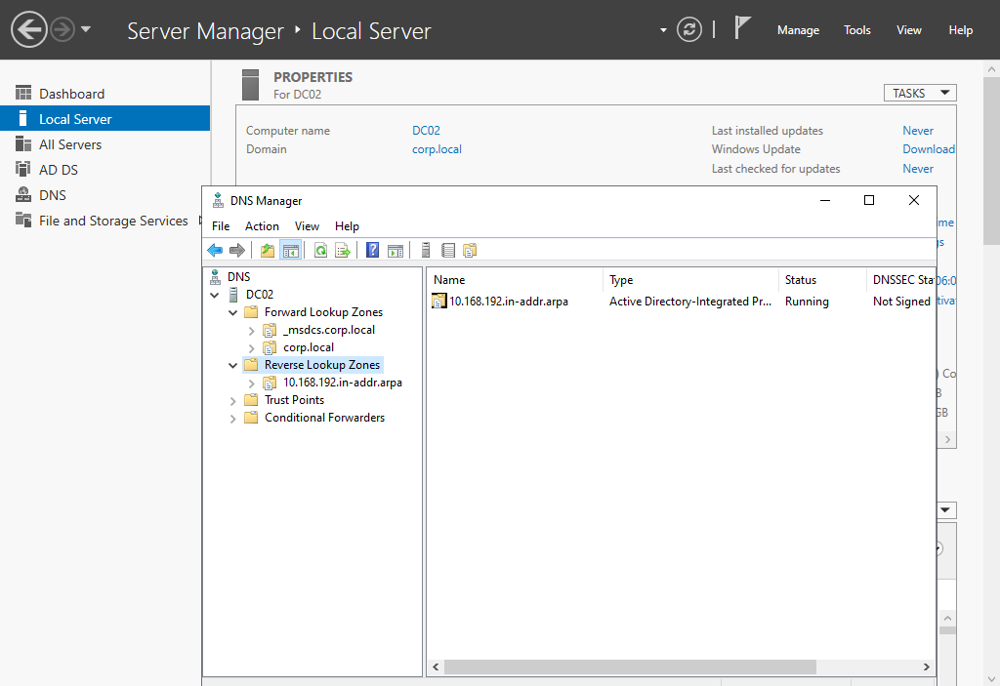
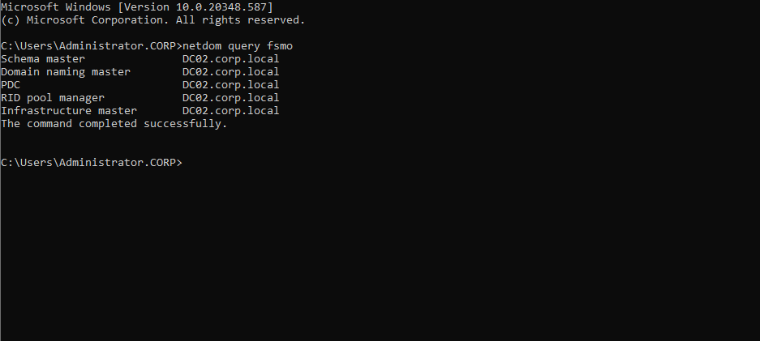
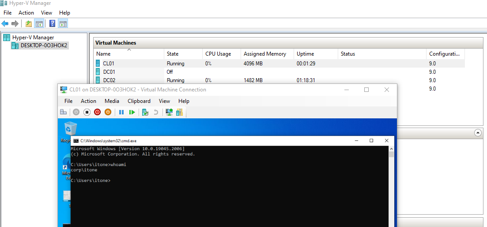
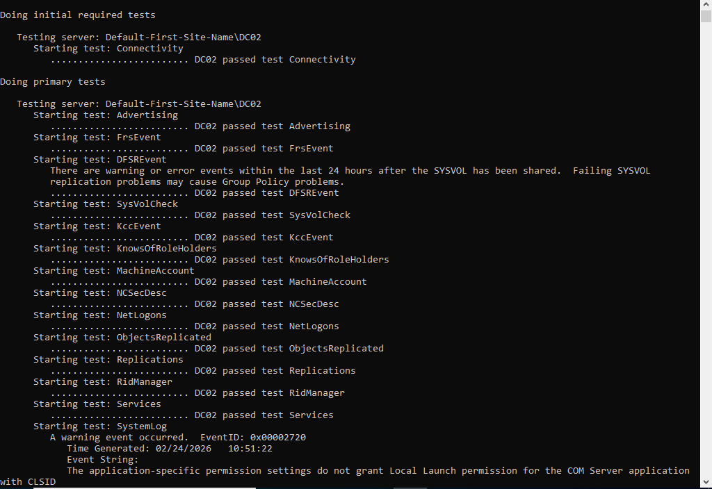

# Windows Server 2022 Enterprise Lab  
## Phase 02 – Redundancy, Replication & FSMO Role Transfer

---

## 1. Executive Overview

Phase 01 established a single Domain Controller (DC01) hosting Active Directory Domain Services (AD DS) and integrated DNS for the `corp.local` domain.

Phase 02 enhances the infrastructure by introducing redundancy through deployment of a second Domain Controller (DC02). This eliminates the single point of failure and validates enterprise-grade identity resilience.

This phase includes:

- Deployment of additional Domain Controller (DC02)
- Active Directory replication validation
- AD-integrated DNS replication validation
- FSMO role transfer
- Controlled DC failure simulation
- Post-change health verification

---

## 2. Updated Architecture

| Server | Role | IP Address |
|--------|------|------------|
| DC01 | Original Domain Controller | 192.168.10.10 |
| DC02 | Additional Domain Controller | 192.168.10.11 |
| CL01 | Domain Client | 192.168.10.20 |

Both DCs operate within the same subnet (`192.168.10.0/24`) under the `corp.local` forest.

---

## 3. DC02 Deployment

### 3.1 Hyper-V Configuration

DC02 was provisioned as a Generation 2 VM with Dynamic Memory enabled.

---

### 3.2 Domain Join (Member Server Stage)

DC02 was joined to `corp.local` prior to AD DS promotion.

---

## 4. AD DS Role Installation & Promotion

### 4.1 AD DS Role Installation

Active Directory Domain Services role installed on DC02.

---

### 4.2 Promotion to Additional Domain Controller

DC02 was promoted using the “Add a domain controller to an existing domain” option.

Replication source: DC01  
Global Catalog: Enabled  
DNS: Installed  

---

## 5. Replication Validation

After promotion, replication health was verified.

### 5.1 Replication Summary

`repadmin /replsummary` confirmed zero replication failures.

---

### 5.2 Detailed Replication Status

`repadmin /showrepl` verified successful inbound replication from DC01.

---

## 6. DNS Replication Verification

Since DNS is AD-integrated, zone replication was validated on DC02.

Zones confirmed:
- corp.local
- _msdcs.corp.local
- Reverse Lookup Zone

---

## 7. FSMO Role Transfer

### 7.1 FSMO Ownership (Before Transfer)

All five FSMO roles were originally held by DC01.

---

### 7.2 FSMO Ownership (After Transfer)

All FSMO roles were transferred successfully to DC02.

Roles transferred:

- Schema Master
- Domain Naming Master
- RID Master
- PDC Emulator
- Infrastructure Master

---

## 8. Controlled Failure Simulation

To validate redundancy, DC01 was powered off in Hyper-V.

Client authentication was tested while DC01 was offline.

Result:  
Authentication continued successfully via DC02.

This confirms service continuity in case of primary DC failure.

---

## 9. Post-Transfer Health Validation

A full domain controller diagnostic was executed on DC02.

All major tests passed including:

- Connectivity
- Advertising
- Replications
- Services
- SysVolCheck

Minor DCOM or event warnings observed were non-critical and common in lab environments following promotion.

---

## 10. Outcome

Phase 02 successfully achieved:

✔ Active Directory redundancy  
✔ Healthy replication between DC01 and DC02  
✔ AD-integrated DNS replication  
✔ FSMO role reassignment  
✔ Verified authentication continuity during DC outage  

The environment is now resilient and aligned with enterprise best practices.

---

## 11. Next Phase

Phase 03 will introduce:

- DHCP deployment strategy
- Administrative delegation
- Group Policy baseline security
- Infrastructure hardening

---

**Author:** Tousif Ahmed  
**Project:** Windows Server 2022 Enterprise Infrastructure Lab  
